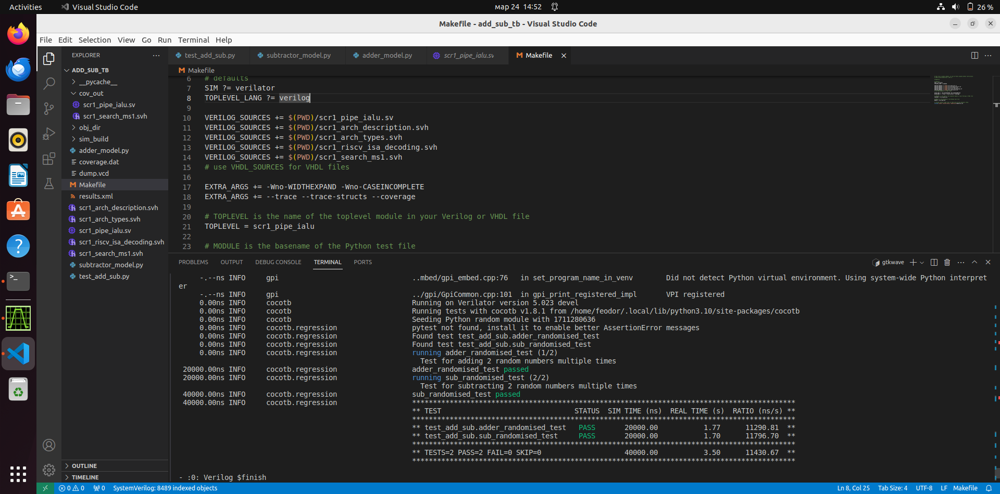
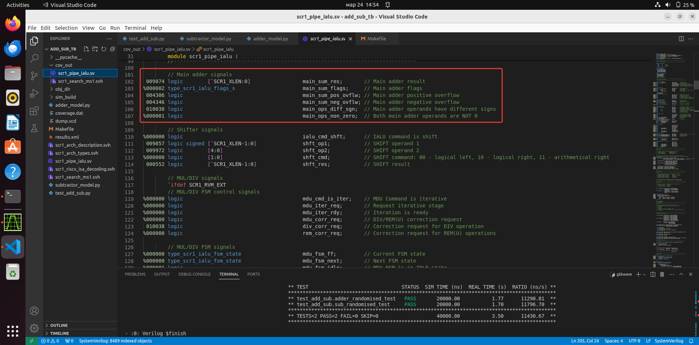
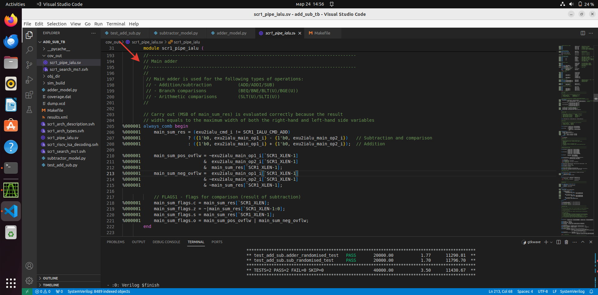
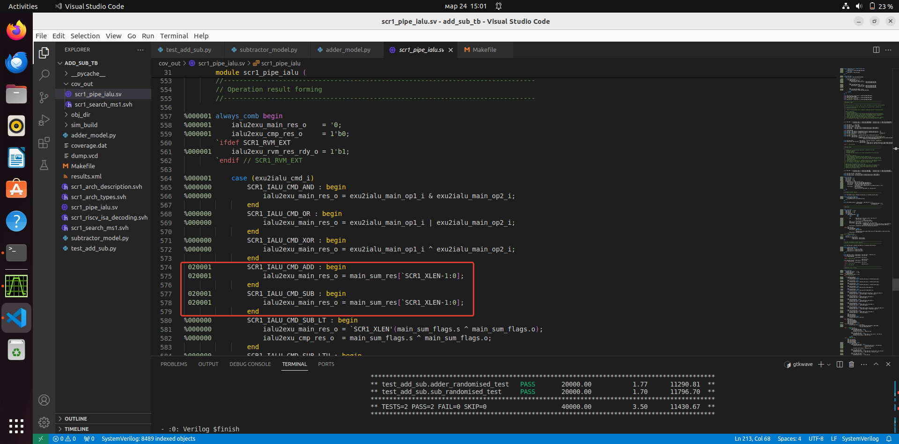
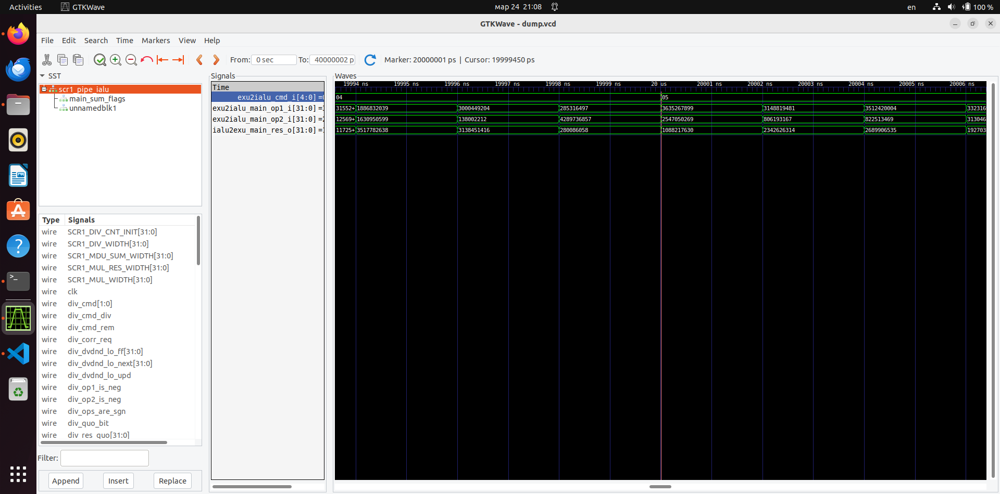

# TestBench для проверки работы операций ADD и SUB в SRC1 iALU 

GitHub репозиторий ядра [SCR1 RISC-V](https://github.com/syntacore/scr1/tree/master)

scr1_pipe_ialu.sv, scr1_arch_description.svh, scr1_arch_types.svh, scr1_riscv_isa_decoding.svh, scr1_search_ms1.svh - исходники на SystemVerilog

adder_model.py, subtractor_model.py - эталонные модели сумматора и вычитателя на Python

test_add_sub.py - testbench на Python с использованием cocotb

## Формат представления целых чисел в Python

В Python знак целого числа хранится отдельно от самого числа:

    > print(bin(-42), bin(42), sep="\n ")
    -0b101010
    0b101010

Поскольку в железе числа представляются в дополнительном коде нужно проделать хитрость для преобразования, заодно убедиться, что результат арифметической операции 32-битный.

Для этого используем маску, которая временно изменяет представление числа из прямого кода в дополнительный:

    > mask = 0b11111111  # Same as 0xff or 255
    > bin(-42 & mask)
    '0b11010110'

## Запуск testbench

Для запуска необходимо выполнить команду `make`

Примечание: при запуске симуляции verilator находит в коде ядра предупреждения (Warning), которые не позволяют запустить тестбенч. Предупреждения не критичны, поэтому игнорируются - для этого в Makefile прописаны дополнительные ключи для verilator: `-Wno-WIDTHEXPAND` и `-Wno-CASEINCOMPLETE`

Результаты тестбенча:

Для просмотора кодового покрытия в Makefile предусмотрен дополнительный ключ для verilator: `--coverage`

С помощью утилиты `verilator_coverage` можно просмотреть кодовое покрытие. Команда для генерации файла, для просмотра кодового покрытия:

    verilator_coverage ./coverage.dat --annotate ./cov_out --annotate-all

Файлы с результатами находятся в директории cov_out. Примечание: каждый раз при генерации файла для просмотра кодового покрытия необходимо удалять директорию cov_out : `rm -r cov_out`

Отображение кодового покрытия:

С помощью gtkwave можно просмотреть временные диаграммы тестбенча. Чтобы сгенерировать файл для просмоматра временных диаграмм используются ключи: `--trace` и `--trace-structs`

    gtkwave dump.vcd

